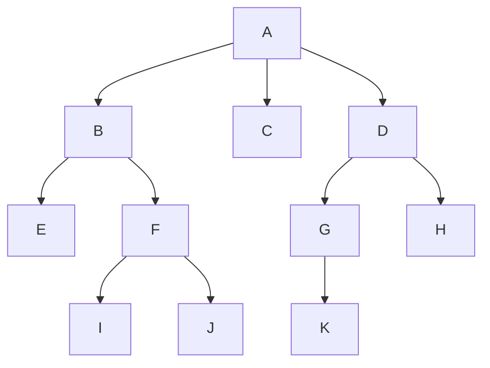

#recursion

参考资料
algoexpert视频 Depth First Search
DFS有两种实现方式
1. 递归实现
2. 迭代实现

迭代实现使用stack, stack先进后出
为什么DFS可以用stack来实现, 因为会优先进入左边的分支节点, 最后才会到根节点右侧分支. 最后从根节点退出

# 题目
现在要遍历下面这颗树的顺序是 `[A, B, E, F, I, J, C, D, G, K, H]`



# 思考
深度优先算法本质上是一种递归算法. 先穷尽每一个分支, 在横向取下一个分支

递归实现
一般数的DFS实现
```python
class Node(value):
	def __init__(self, name):
		self.name = name
		seff.children = []
	
	def add_child(node):
		self.children.append(node)

	def depth_first_search(array=[]):
		array.append(self.name)
		if len(self.children) > 0:
			for child in self.children:
				child.depth_first_search(array)
		return array
```


二叉树的DFS实现
```python
def depth_first_search(node, ret=[]):
    ret.append(node.data)
    if node.leftChild is not None:
        depth_first_search(node.leftChild, ret)
    if node.rightChild is not None:
        depth_first_search(node.rightChild, ret)
    return ret	
```

迭代实现

```python
def depth_first_search(node):

```