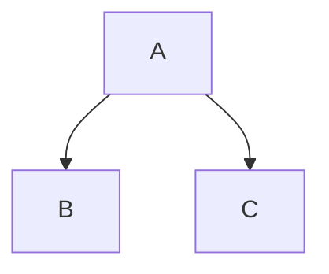

# 树
每一棵树都有根节点, 遍历一颗树是从他的根节点开始的
节点个数是vertice
节点之间的连线称为边 edge
数的层称为degree


```python
class Node:
	def __init__(self, name):
		self.children = []
		self.name = name
		
	def addChild(self, name):
		self.children.append(Node(name))
	
	def depthFirstSearch(self, array):
		array.append(self.name)
		if len(self.children) == 0:
			return array
		for child in self.children:
			child.depthFirstSearch(array) # 注意这里调用的对象是child
		
```

问题: 
为什么dfs的算法复杂度是 O(v + e) 这里v表示vertice, e表示edge
空间复杂度是(v)

# 二叉树
什么是二叉树, 每一个节点至多只有两个分叉的树
```python
class BinaryTreeNode:
	def __init__(self, data):
		self.data = data
		self.leftChild = None
		self.leftChild = None
		
```

构建一个二叉树

```python
nodeA = BinaryTreeNode('A')
nodeB = BinaryTreeNode('B')
nodeC = BinaryTreeNode('C')

nodeA.leftChild = nodeB
nodeA.rightChild = nodeC
```